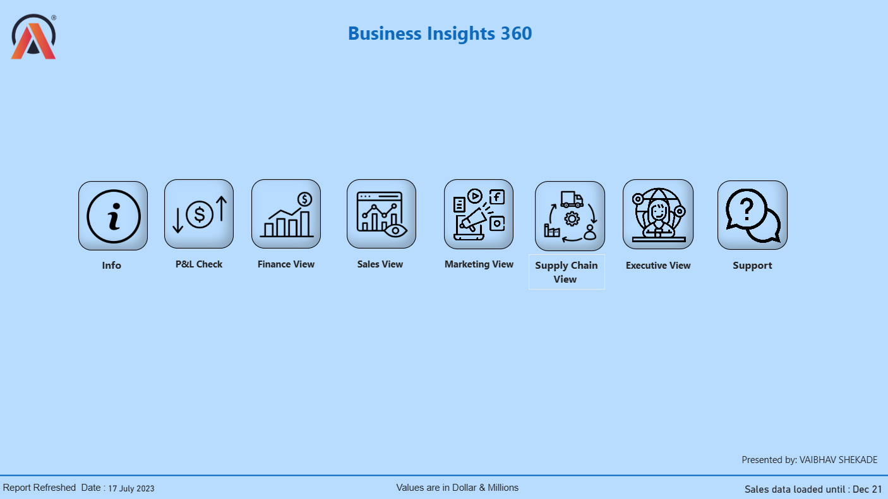
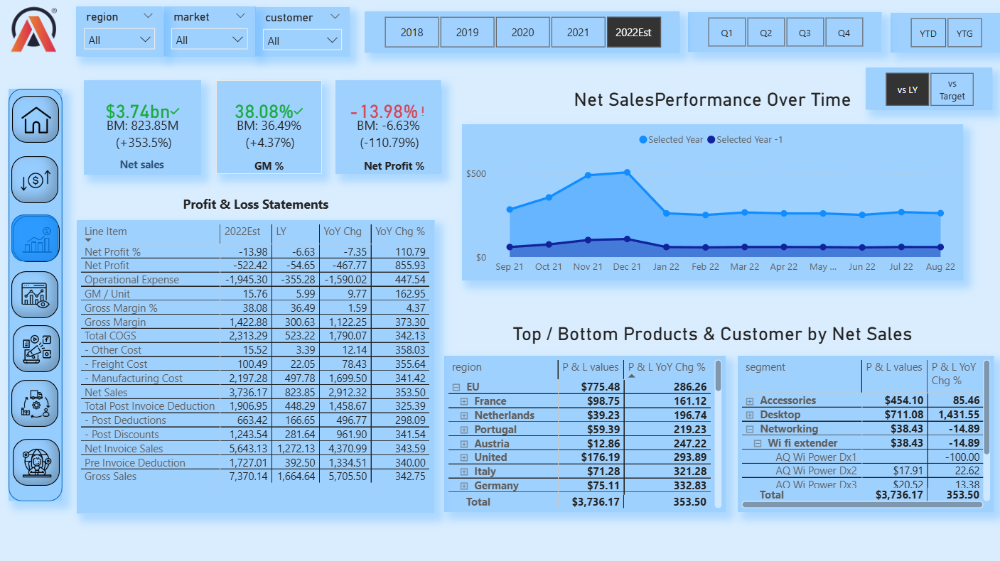
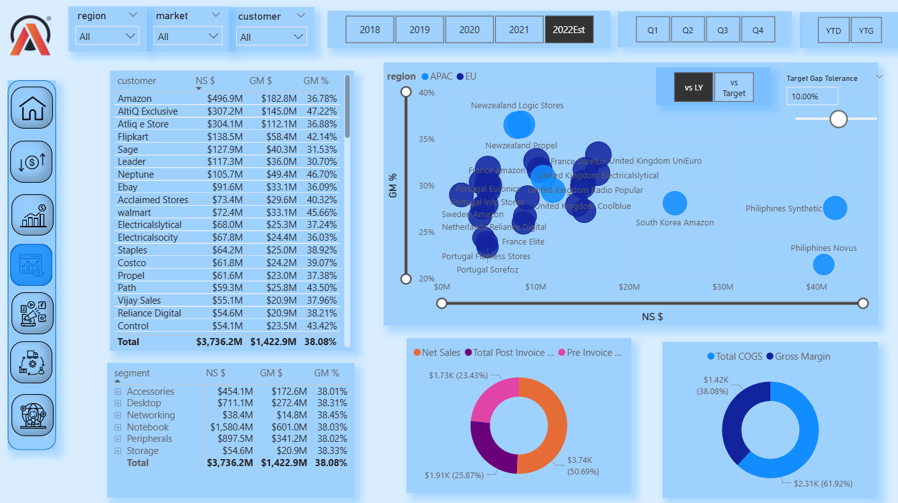
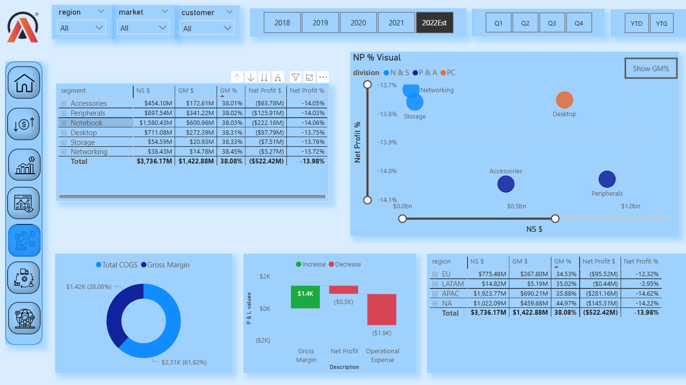
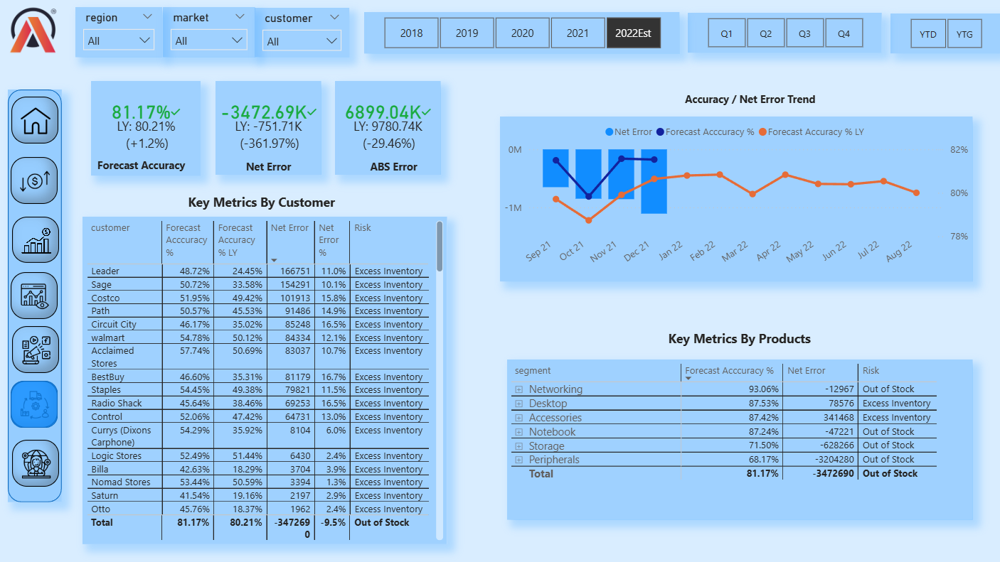

# Business Insights 360 — Power BI Report


---

## Table of contents

* [Overview](#overview)
* [Pages & Purpose (page-by-page guide)](#pages--purpose-page-by-page-guide)

  * [Home](#home)
  * [Finance View](#finance-view)
  * [Sales View](#sales-view)
  * [Marketing View](#marketing-view)
  * [Supply Chain View](#supply-chain-view)
  * [P&L Check](#pl-check)
* [Common interactions & controls](#common-interactions--controls)
* [Key DAX measures & modeling notes](#key-dax-measures--modeling-notes-recommended)


---

# Overview

**Business Insights 360** is a multi-page Power BI report designed to provide a 360° view of business performance — finance, sales, marketing and supply chain — using KPI cards, tables, charts, and interactive selectors (slicers). Each page focuses on a functional domain and enables cross-filtering and drill-through for exploratory analysis.

---

# Pages & Purpose (page-by-page guide)

> Each page description below includes: purpose, key visuals, and suggested use-cases for business users.

## Home

**Purpose:** Landing / navigation page. Provides a high-level entry point into the report and links to other pages.

**Key features:**

* Title and branding (report name / presenter).
* Large navigation icons (clickable bookmarks or page navigation buttons) to quickly jump to Finance, Sales, Marketing, Supply Chain, and Support pages.
  
**Use cases:** Executive or new users who want an overview and quick access.



---

## Finance View

**Purpose:** Deep-dive into company financials — Net Sales, Gross Margin, Net Profit, and a full Profit & Loss breakdown.

**Key features:**

* KPI cards for Net Sales, GM % and Net Profit % (with comparisons to benchmark or last year).
* Year / quarter / YTD selectors (bookmark or buttons).
* P&L table showing line items: Gross Sales, COGS, Gross Margin, Operational Expense, Net Profit, and breaks (post-invoice deductions, discounts).
* Time-series line chart for Net Sales Performance, with ability to show selected year vs prior year.
* Top / Bottom product and customer tables (by Net Sales).
* Left-side icon navigation for switching pages.
  
**Use cases:** Financial analysts reviewing monthly/quarterly P&L, presenting variance to prior year, investigating cost drivers.



---

## Sales View

**Purpose:** Sales performance analysis by customer, market, or product segment.

**Key features:**

* Customer table with Net Sales, GM $ and GM %.
* Bubble chart (Net Sales on X, GM % on Y) for customer/product clustering and segmentation.
* Segment breakdown table and donut charts showing contribution by category.
* Year and filter selectors are consistent with other pages.
  
**Use cases:** Sales managers identifying high-value customers, analyzing margin vs volume trade-offs, spotting growth opportunities or risk.



---

## Marketing View

**Purpose:** Link marketing activities to profitability and P&L impact — visibility into product/segment profitability and marketing-driven KPIs.

**Key features:**

* Scatter/bubble visualization of Net Profit % vs NS $ (product or segment level).
* P&L waterfall (or change chart) to show movement between Gross Margin → Net Profit → Operational Expense.
* Donut charts summarizing COGS vs Gross Margin.
* Region or campaign level tables for deeper inspection.
  
**Use cases:** Marketing leads wanting to justify spend vs financial outcomes and evaluate campaign impact on margins.



---

## Supply Chain View

**Purpose:** Inventory, forecast accuracy, and supply chain KPIs (forecast error, ABS error, stock risks).

**Key features:**

* KPI cards: Forecast Accuracy %, Net Error, ABS Error.
* Net Error / Forecast Accuracy trend line & bar visual to monitor monthly performance.
* Customer and product level tables with Forecast Accuracy, Net Error, and Risk classifications (e.g., Excess Inventory, Out of Stock).
* Target gap tolerance control and toggle (vs LY / vs target), to quickly evaluate performance vs goals.
  
**Use cases:** Supply chain managers tracking forecast performance, prioritizing inventory actions, and identifying high-risk products or customers.



---

## P&L Check

**Purpose:** Focused diagnostics and validation for Profit & Loss figures — used as a reconciliation and audit page.

**Key features:**

* Detailed P&L with breakdowns and yearly comparisons.
* Tools or visuals to check data integrity (e.g., variance checks, reason codes).
  
**Use cases:** Finance team reconciliation before management reporting.


---

# Common interactions & controls

* **Slicers / Filters**: Region, Market, Customer — global slicers that filter all visuals when selected.
* **Year / Quarter Controls**: Typically implemented via bookmarks or buttons to switch to 2018–2022Est and Q1–Q4.
* **Toggle Buttons**: `vs LY` (last year) / `vs Target` switches that change measure behavior on charts.
* **Target Gap Slider**: Adjust tolerance for target comparisons (used in gauges or conditional formatting).
* **Cross-filter & Highlight**: Clicking a value in a table or chart filters/highlights related visuals across the page.
* **Tooltips**: Hover over points and bars to view additional metrics (ex: values, percentages, trends).
* **Navigation Icons**: Left-side icon panel to move between main report pages.

---

# Key DAX measures & modeling notes 


```dax
-- Net Sales
Net Sales = SUM(Sales[NetSalesAmount])

-- Gross Margin
Gross Margin = SUM(Sales[GrossMarginAmount])

-- Gross Margin %
GM % = DIVIDE([Gross Margin], [Net Sales], 0)

-- Net Profit
Net Profit = SUM(Finance[NetProfitAmount])

-- Net Profit %
Net Profit % = DIVIDE([Net Profit], [Net Sales], 0)

-- Year-on-Year Net Sales Change
YoY Net Sales = 
VAR Prev = CALCULATE([Net Sales], PREVIOUSYEAR(Date[Date]))
RETURN DIVIDE([Net Sales] - Prev, Prev, 0)
